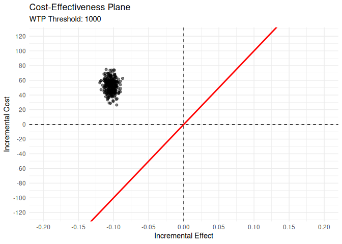
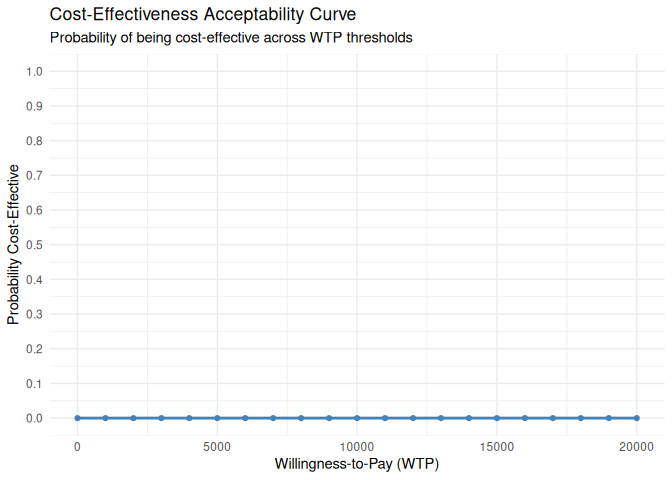

CEACT Package
================

# CEACT: Cost-Effectiveness Analysis for Clinical Trials

## Overview

**CEACT** *(Cost-Effectiveness Analysis for Clinical Trials)* is an R
package designed to facilitate the economic evaluation of healthcare
interventions in randomized trials. It offers a suite of functions for
estimating and visualizing core cost-effectiveness metrics, including:

- Incremental Cost-Effectiveness Ratios (ICER),
- Cost-effectiveness planes,
- Cost-effectiveness acceptability curves (CEAC),
- Net monetary benefit (NMB) metrics.

CEACT is built using a formula-friendly, tidyverse-inspired interface to
streamline analysis workflows.

------------------------------------------------------------------------

## Installation

``` r
# Install from GitHub using devtools
# install.packages("devtools")
#devtools::install_github("ielbadisy/CEACT")
library(CEACT)
```

------------------------------------------------------------------------

## Key Features

- `cea()`: Estimate ICER and generate a descriptive cost-effectiveness
  summary.
- `boot_icer()`: Perform bootstrap-based uncertainty analysis for ICER.
- `plot_ceplane()`: Visualize the cost-effectiveness plane with optional
  quadrant breakdown.
- `plot_ceac()`: Plot the cost-effectiveness acceptability curve.
- `compute_nmb_ceac()`: Compute expected NMB and probability of
  cost-effectiveness across WTP values.

------------------------------------------------------------------------

## Example Usage

### Simulate Trial Data

``` r
set.seed(123)

control <- data.frame(
  cost = rnorm(200, 500, 100),
  effect = rnorm(200, 0.4, 0.05),
  group = "control"
)

treatment <- data.frame(
  cost = rnorm(200, 550, 100),
  effect = rnorm(200, 0.3, 0.06),
  group = "treatment"
)

df <- rbind(control, treatment)
```

### Run Cost-Effectiveness Analysis

``` r
res_cea <- CEACT::cea(cost + effect ~ group, data = df, ref = "control")
summary(res_cea)
```

    ## Cost-Effectiveness Summary
    ## Formula:  cost + effect ~ group 
    ## Reference Group:  control 
    ## ICER: -522.481 
    ## 
    ##       Outcome           Control         Treatment  Delta            CI p.value
    ## 1   Mean Cost 499.14 (sd 94.32) 553.18 (sd 96.48) 54.035 [35.28;72.79]  <0.001
    ## 2 Mean Effect     0.4 (sd 0.05)     0.3 (sd 0.06) -0.103 [-0.11;-0.09]  <0.001

### Bootstrap the ICER

``` r
res_boot <- CEACT::boot_icer(cost + effect ~ group, data = df, ref = "control", R = 300)
summary(res_boot)
```

    ##         Metric Estimate Observed StdError   Bias                  CI
    ## 1   Delta Cost   52.553   54.035    8.983 -1.481     [37.634;73.698]
    ## 2 Delta Effect   -0.104   -0.103    0.006  0.000     [-0.114;-0.092]
    ## 3         ICER -508.609 -522.481   88.503 13.873 [-718.413;-366.257]

### Visualize the Cost-Effectiveness Plane

``` r
CEACT::plot_ceplane(res_boot, k = 1000)
```

<!-- -->

### Plot the CEAC

``` r
CEACT::plot_ceac(res_boot, wtp_range = seq(0, 20000, 1000))
```

<!-- -->

### Compute NMB and CEAC Table

``` r
nmb_table <- CEACT::compute_nmb_ceac(cost + effect ~ 1, data = df, wtp_range = seq(0, 20000, 1000))
head(nmb_table)
```

    ##    WTP      ENMB Prob_CE
    ## 1    0 -526.1603  0.0000
    ## 2 1000 -175.7638  0.1125
    ## 3 2000  174.6327  0.8100
    ## 4 3000  525.0292  0.9750
    ## 5 4000  875.4256  1.0000
    ## 6 5000 1225.8221  1.0000

------------------------------------------------------------------------

## Feedback & Contributions

We welcome feedback, issues, and pull requests.  
Contribute via the [GitHub Issues
page](https://github.com/ielbadisy/CEACT/issues).

------------------------------------------------------------------------

## TODO

- [x] Formula-based interface across all functions
- [x] Optional quadrant labels in CE plane
- [x] Improved p-value formatting
- [x] Complete function-level documentation using **roxygen2**
- [ ] Fix warnings and notes
- [ ] Add unit tests using **testthat**
- [ ] Create a PDF vignette
- [ ] Write a comprehensive tutorial or use-case article
- [ ] Submit to **CRAN**

------------------------------------------------------------------------
