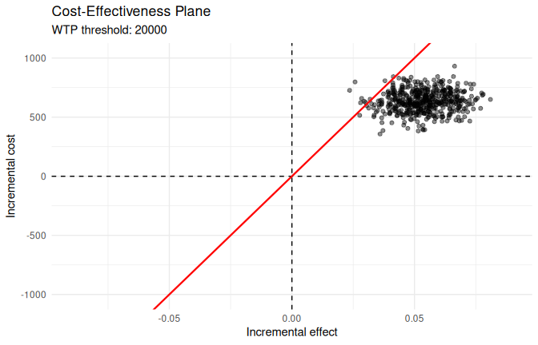
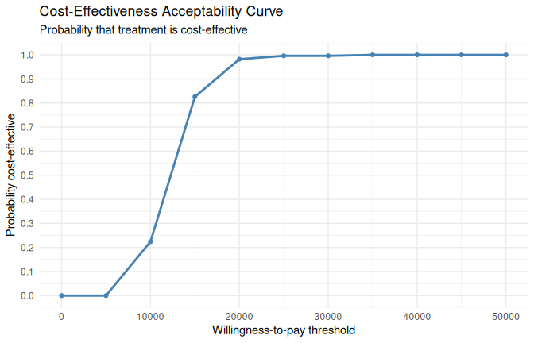
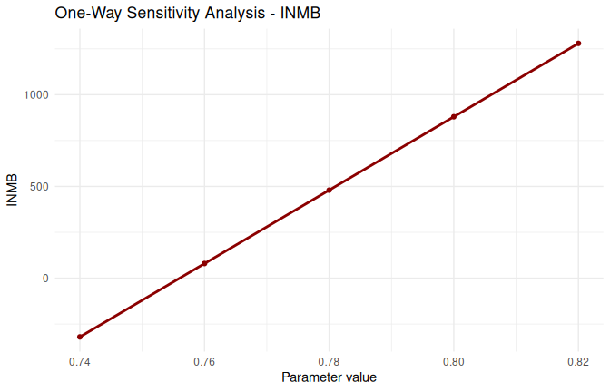

CEACT Package
================

## Overview

**CEACT** *(Cost-Effectiveness Analysis for Clinical Trials)* is an R
package for two-arm trial-based economic evaluation. It implements a
formula-based workflow for:

- observed incremental cost, incremental effect, and ICER summaries;

- stratified non-parametric bootstrap uncertainty;

- incremental net monetary benefit (INMB);

- cost-effectiveness acceptability curves (CEACs);

- cost-effectiveness planes;

- one-way deterministic sensitivity analysis.

CEACT is intended for individual-level clinical-trial datasets with one
cost variable, one effect variable, and a two-level treatment group.

## Installation

``` r
# install.packages("devtools")
devtools::install_github("ielbadisy/CEACT")
```

``` r
library(CEACT)
```

## Simulate Trial Data

``` r
trial <- simulate_ce_trial(n = 200, seed = 123)
head(trial)
#>       cost    effect   group
#> 1 4495.572 0.9289862 control
#> 2 4792.840 0.8463038 control
#> 3 6402.837 0.7171661 control
#> 4 5063.458 0.7747625 control
#> 5 5116.359 0.6809741 control
#> 6 6543.558 0.6986401 control
```

## Observed Cost-Effectiveness Summary

``` r
res_cea <- cea(cost + effect ~ group, data = trial, ref = "control")
summary(res_cea)
#> Cost-Effectiveness Summary
#> Formula: cost + effect ~ group
#> Reference group: control
#> Treatment group: treatment
#> Incremental cost: 639.489
#> Incremental effect: 0.054
#> ICER: 11818.69
#> 
#>              Outcome             Reference             Treatment Difference
#> delta_cost      Cost 4992.287 (SD 848.844) 5631.775 (SD 964.805)    639.489
#> delta_effect  Effect      0.724 (SD 0.099)      0.778 (SD 0.113)      0.054
#>                             CI p.value
#> delta_cost   [460.84; 818.138]  <0.001
#> delta_effect    [0.033; 0.075]  <0.001
```

## Bootstrap Uncertainty

``` r
set.seed(42)
res_boot <- boot_icer(cost + effect ~ group, data = trial, ref = "control",
                      R = 500, ci.type = "perc")
summary(res_boot)
#>                   Metric  Observed BootstrapMean StdError    Bias
#> DeltaCost     Delta Cost   639.489       634.728   90.584  -4.761
#> DeltaEffect Delta Effect     0.054         0.054    0.010  -0.001
#> ICER                ICER 11818.694     12310.932 3130.320 492.238
#>                                CI
#> DeltaCost      [455.471; 810.055]
#> DeltaEffect        [0.033; 0.073]
#> ICER        [7529.884; 18944.767]
```

## Cost-Effectiveness Plane

``` r
plot_ceplane(res_boot, k = 20000)
```

<!-- -->

## Net Monetary Benefit and CEAC

``` r
ceac_table <- compute_nmb_ceac(res_boot, wtp_range = seq(0, 50000, 5000))
head(ceac_table)
#>     WTP       ENMB Prob_CE
#> 1     0 -639.48888   0.000
#> 2  5000 -368.94762   0.000
#> 3 10000  -98.40636   0.224
#> 4 15000  172.13490   0.826
#> 5 20000  442.67616   0.982
#> 6 25000  713.21742   0.996
plot_ceac(ceac_table)
```

<!-- -->

## Deterministic Sensitivity Analysis

``` r
dsa_result <- dsa_icer(cost + effect ~ group, data = trial,
                       param = "effect",
                       range = seq(0.74, 0.82, 0.02),
                       ref = "control",
                       metric = "INMB",
                       k = 20000)
dsa_result
#>   Parameter       INMB
#> 1      0.74 -320.20684
#> 2      0.76   79.79316
#> 3      0.78  479.79316
#> 4      0.80  879.79316
#> 5      0.82 1279.79316
plot_dsa(dsa_result, metric = "INMB")
```

<!-- -->

## Trial-Based CEA Dataset

CEACT also includes `trial_cea`, a 500-patient example dataset with
treatment, total cost, and QALY outcomes used in teaching material for
trial-based economic evaluation.

``` r
data("trial_cea")
real_res <- cea(cost + qaly ~ group, data = trial_cea, ref = "control")
summary(real_res)
#> Cost-Effectiveness Summary
#> Formula: cost + qaly ~ group
#> Reference group: control
#> Treatment group: treatment
#> Incremental cost: 25
#> Incremental effect: 0.042
#> ICER: 588.802
#> 
#>              Outcome          Reference          Treatment Difference
#> delta_cost      Cost 3015 (SD 1582.802) 3040 (SD 1168.737)     25.000
#> delta_effect  Effect   0.573 (SD 0.217)   0.615 (SD 0.205)      0.042
#>                             CI p.value
#> delta_cost   [-219.54; 269.54]  0.8409
#> delta_effect     [0.005; 0.08]  0.0251
```

## Citation

Use the following citation for publications that reference CEACT:

``` r
citation("CEACT")
```

> To cite package 'CEACT' in publications use:
>
>   EL BADISY I (2026). _CEACT: Cost-Effectiveness Analysis Toolkit for
>   Clinical Trials_. R package version 0.5.0,
>   <https://CRAN.R-project.org/package=CEACT>.

BibTeX entry for LaTeX users:

``` bibtex
@Manual{,
  title = {CEACT: Cost-Effectiveness Analysis Toolkit for Clinical Trials},
  author = {Imad {EL BADISY}},
  year = {2026},
  note = {R package version 0.5.0},
  url = {https://CRAN.R-project.org/package=CEACT},
}
```

## Package Quality

- Unit tests are implemented with **testthat**.

- Function documentation is generated with **roxygen2**.

- A PDF vignette is available in `vignettes/`.

- The package source builds and checks successfully with `R CMD check`.
